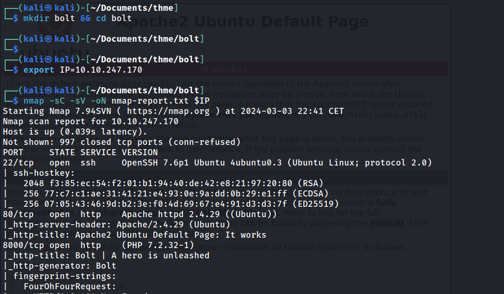
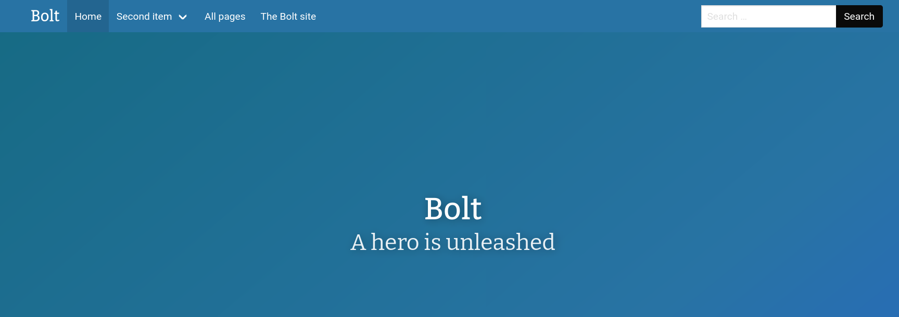
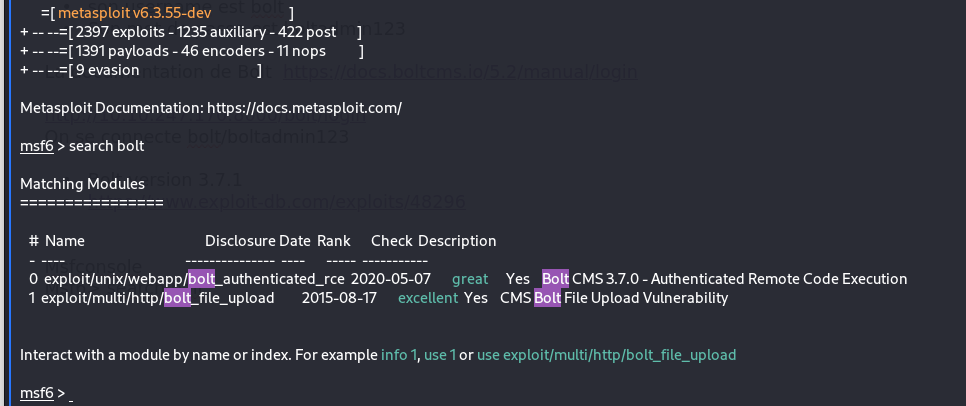
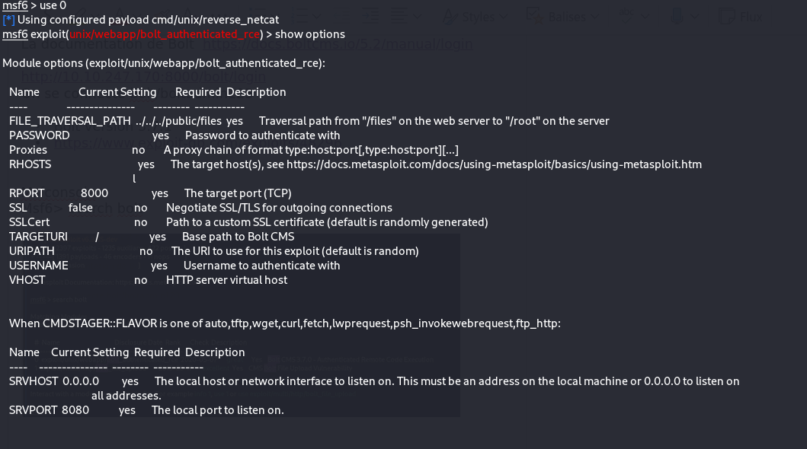
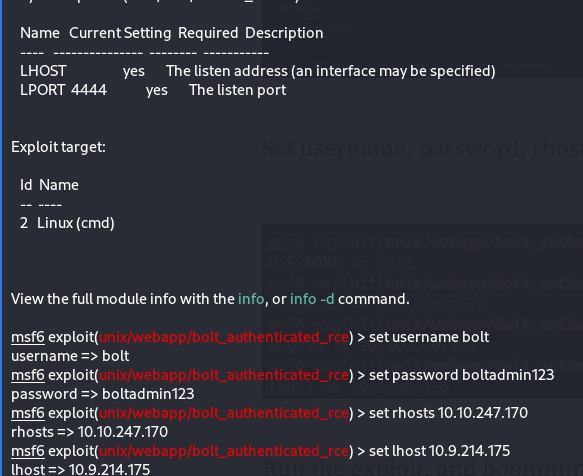
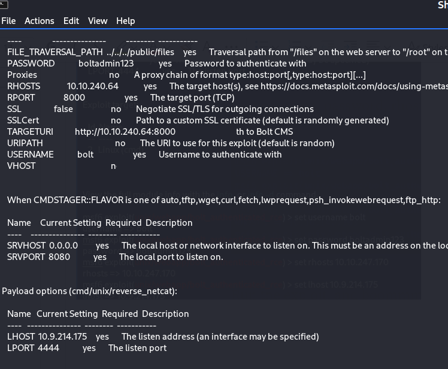
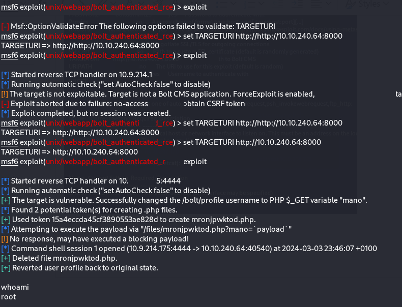
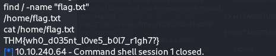

# 🐕 Bolt



Lien Gitbook: [ https://olb.gitbook.io/thm-ctf-write-ups/bolt](https://olb.gitbook.io/thm-ctf-write-ups/bolt)

IP=10.10.247.170&#x20;

Site Apache => [http://10.10.247.170/](http://10.10.247.170/)&#x20;

## Nmap

<figure><figcaption></figcaption></figure>

* Résultats:
  * Ubuntu&#x20;
  * Port 22 open SSH&#x20;
  * Port 80 open http&#x20;
    * Apache 2.4.29&#x20;
  * Port 8000 open http&#x20;
    * Php 7.2.32-1&#x20;
    * Générator : BOLT&#x20;

On se rend sur [http://10.10.247.170:8000/](http://10.10.247.170:8000/)&#x20;

<figure><figcaption></figcaption></figure>

Des infos a la lecture du blog:

* L'admin s'appelle `Jake`
* son username est `bolt`&#x20;
* Son mot de passe est `boltadmin123`&#x20;

&#x20;On creuse un peu la documentation de Bolt et on trouve la page de login:  [https://docs.boltcms.io/5.2/manual/login](https://docs.boltcms.io/5.2/manual/login)&#x20;

&#x20;On se rend donc sur [http://10.10.247.170:8000/bolt/login](http://10.10.247.170:8000/bolt/login)&#x20;

On se connecte `bolt:boltadmin123`&#x20;

Sur l'interface d'admin on obtient des infos:

* Bolt version 3.7.1&#x20;
* Cette version après recherche Google semble vulnérable [https://www.exploit-db.com/exploits/48296](https://www.exploit-db.com/exploits/48296)&#x20;

## Metasploit

```
Msfconsole 
```

```
Msf6> search bolt 
```

Utilsation de la RCE identifiée

<figure><figcaption></figcaption></figure>


<figure><figcaption></figcaption></figure>

<figure><figcaption></figcaption></figure>

Après plusieurs tentative je fini par y arriver en ajoutant la variable `TARGETURI` comme indiqué ci dessous

<figure><figcaption></figcaption></figure>

<figure><figcaption></figcaption></figure>

Ensuite en mode fainéant , j'ai cherché directement le fichier flag.txt n'ayant rien trouvé aux endroits habituels (racine ou /root ou /home/user)

<figure><figcaption></figcaption></figure>
