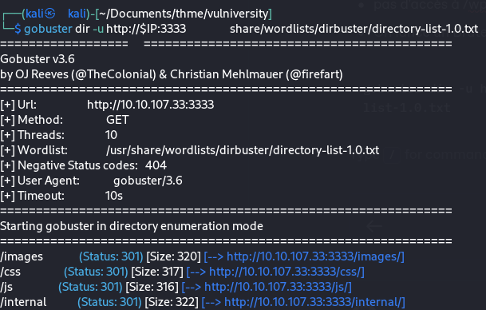

# 🏫 Vulniversity



Site Gitbook: [https://olb.gitbook.io/thm-ctf-write-ups/vulniversity](https://olb.gitbook.io/thm-ctf-write-ups/vulniversity)

## Reconnaissance

```
export IP=10.10.107.33
```

```
nmap -sC -sV -oN nmap-report.txt $IP
```

<figure><figcaption></figcaption></figure>

Ports / services ouverts:

* ftp (22)
* ssh (23)
* samba (139/445)
* proxy Squid (3128)
* Serveur web Apache (3333)

Petit tour sur le site [http://10.10.107.33:3333/](http://10.10.107.33:3333/)

* code source : c'est un site sous Wordpress (pas d'info visible de sa version ...)
* pas d'accès à `/wp-admin` ou `/admin`
* pas d'accès au `robots.txt` ou au `sitemap.xml`
* On lance donc un Brute Force de directory pour voir...


```
gobuster dir -u http://$IP:3333 -w /usr/share/wordlists/dirbuster/directory-list-1.0.txt
```


<figure><figcaption></figcaption></figure>

* le répertoire `/internal` attire rapidement l'attention

<figure><figcaption></figcaption></figure>

* C'est un formulaire d'upload de fichier :)
*   Ici on est bien aidé par l'auteur de la Box qui nous invite a tester les extensions suivantes

    * .php
    * .php3
    * .php4
    * .php5
    * .phtml


* On soumet donc un fichier de test et on intercepte la requête avec `Burp Suite proxy`

<figure><figcaption></figcaption></figure>

on envoie la requête dans l'intruder pour faire du fuzzing sur l'extension du fichier soumis  comme indiqué&#x20;

<figure><figcaption></figcaption></figure>

<figure><figcaption></figcaption></figure>

On lance l'attaque

<figure><figcaption></figcaption></figure>

* Ici la longueur de la réponse pour l'extension `.phtml` attire l'attention ...
* En vérifiant la réponse on a bien un message `"Success"`

On va donc pouvoir uploader un reverse-shell en php par exemple [celui-ci](https://github.com/pentestmonkey/php-reverse-shell/blob/master/php-reverse-shell.php) . Avant bien sûr on le renomme en .phtml et on s'assure de renseigner dans le fichier son IP et son port d'écoute:

<figure><figcaption></figcaption></figure>

Une fois chargé via le formulaire, on va le retrouver dans [http://10.10.107.33:3333/internal/uploads/](http://10.10.107.33:3333/internal/uploads/) \
NB: ici l'auteur de la box nous aide en indiquant ce sous-répertoire mais en relançant gobuster (qui n'est pas récursif) sur `'http://10.10.107.33/internal'` on découvre facilement ce répertoire ;)

<figure><figcaption></figcaption></figure>

on lance sur notre Kali un netcat en écoute sur le port indiqué dans le fichier&#x20;

```
nc -lnvp 1234
```

et on demande au serveur web d’exécuter le fichier:  [http://10.10.107.33:3333/internal/uploads/php-reverse-shell.phtml](http://10.10.107.33:3333/internal/uploads/php-reverse-shell.phtml)

Normalement on se retrouve immédiatement  avec un shell actif sur la cible en tant que user `www-data`

<figure><figcaption></figcaption></figure>

On nous demande le flag du user `bill`.

Ici pas besoin d'escalade de privilège pour trouver le flag puisque le répertoire `home` de bill est accessible en lecture à tous les utilisateurs (mode CTF easy ! )

```
cat /home/bill/user.txt
```

<figure><figcaption></figcaption></figure>

Et voila :v:
